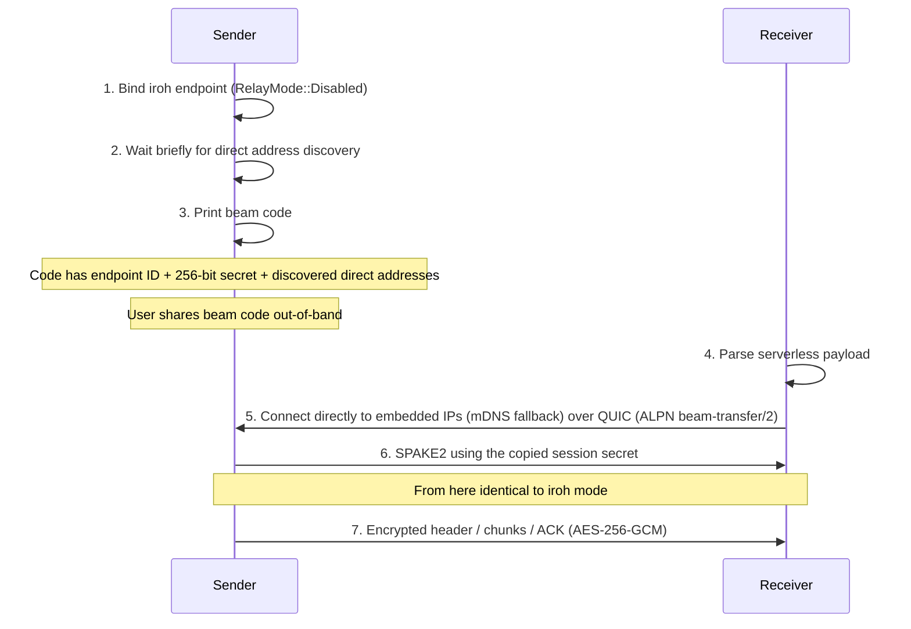
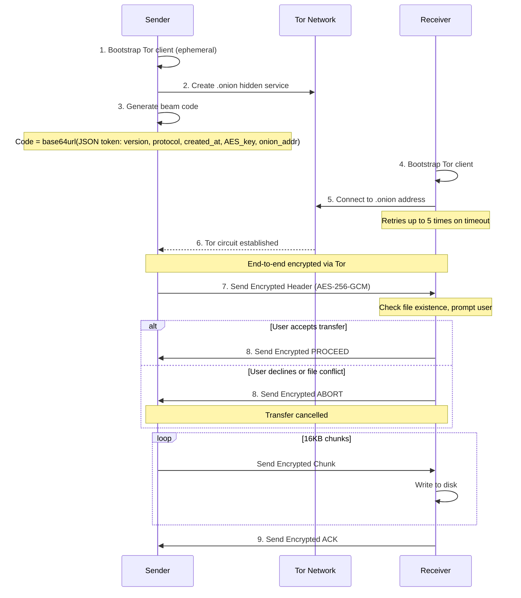

# Beam-rs Architecture

## Overview

This document provides a detailed walkthrough of the beam-rs implementation.

beam-rs supports the following transfer modes:

1. **Default Iroh mode** (Recommended) - Direct P2P transfers using iroh's QUIC/TLS stack (automatic relay fallback) via `beam-rs send`. Requires internet access.
2. **PIN mode** - publishes an encrypted ephemeral node-ID record over Nostr and mDNS, then authenticates and derives the content key with SPAKE2. A PIN is valid once for 120 seconds.
3. **Serverless Mode** - uses iroh with relays and internet discovery disabled via `beam-rs send --serverless`. A pasted serverless payload carries the node ID, a 256-bit session secret, and discovered direct addresses. Adding `--pin` replaces the pasted payload with LAN-only mDNS PIN discovery.
4. **Tor Mode** - Anonymous transfers via Tor hidden services (uses `arti`) via `beam-rs send --tor`. Requires internet access.

## Transfer Flows

### 1. iroh Transfers

#### Default Iroh mode (Recommended) - QUIC / Direct + Relay

iroh uses a "hole punching" strategy that attempts direct connections via UDP/QUIC while simultaneously establishing a fallback path through a Relay (DERP) server.

```mermaid
sequenceDiagram
    participant Sender
    participant Relay as iroh Relay
    participant Receiver

    Sender->>Sender: 1. Create iroh Node (Random NodeID)
    Sender->>Relay: 2. Connect to Home Relay

    Sender->>Sender: 3. Generate beam code
    Note over Sender: Code = base64url(JSON token: version, protocol, created_at, session secret, minimal addr)
    Note over Sender: Minimal addr = NodeID + selected relay URL + optional custom relay list

    Receiver->>Receiver: 4. Parse Code -> NodeAddr
    Receiver->>Relay: 5. Connect to Relay

    par Connection Attempts
        Receiver->>Relay: A. Dial via Relay (Guaranteed)
        Receiver->>Sender: B. Dial Direct UDP (Optimization)
    end

    Note over Sender,Receiver: iroh selects best path (Direct > Relay)

    Sender->>Receiver: 6. QUIC handshake (ALPN "beam-transfer/2")
    Receiver->>Sender: 7. SPAKE2 proof + authenticated receiver NodeID
    Note over Sender: Compare claimed NodeID with Connection::remote_id(); reject mismatches
    Sender->>Receiver: 8. Mutual key confirmation
    Sender->>Receiver: 9. Send Encrypted Header (AES-256-GCM)
    Note over Receiver: Check file existence, prompt user

    alt User accepts transfer
        Receiver->>Sender: 10. Send Encrypted PROCEED
    else User declines or file conflict
        Receiver->>Sender: 10. Send Encrypted ABORT
        Note over Sender,Receiver: Transfer cancelled
    end

    loop 16KB chunks
        Sender->>Receiver: Send Encrypted Chunk (QUIC Stream)
    end

    Receiver->>Sender: 11. Send Encrypted ACK
```

#### Serverless Mode (iroh with relays disabled)

Serverless mode is for transfers without any third-party server. Both endpoints
use `RelayMode::Disabled`, omit n0 DNS/pkarr publishing and lookup, and retain
only iroh's mDNS address lookup. Before printing the code, the sender waits for
a direct address. The serverless beam payload contains a schema version, endpoint
ID, fresh 256-bit session secret, and every discovered direct socket address.
The receiver constructs its target from those embedded addresses, while mDNS
continues as a fallback. After connecting, both sides run SPAKE2 with the
payload's secret; the derived key encrypts the application protocol.

With `--serverless --pin`, no long payload is copied. The sender advertises the
same encrypted PIN rendezvous record used by normal PIN mode, but only through
mDNS. Its PIN starts with `B`, so the receiver selects LAN-only discovery and a
relayless, mDNS-only endpoint before doing any lookup. The one displayed PIN
expires after 120 seconds, at which point the sender exits rather than rotating
it.



### 2. Tor Transfers

#### Tor Mode



## Connection Types/Modes

### Default Iroh mode (`beam-rs send`) - Recommended

- **Transport**: QUIC / TLS 1.3
- **Discovery**: Selected relay URL embedded in the beam code, optional custom relay list from `--relay-url`, plus mDNS for local network.
- **Relay**: iroh relays (DERP) - automatically used if direct P2P connection fails.
- **Failover**: Uses multiple relays for redundancy; monitors latency to select the best path.
- **Connection**: "Hole punching" attempts to establish a direct UDP connection; falls back to relay if NATs are strict.
- **Protocol**: ALPN `beam-transfer/2`.
- **PIN Support**: Yes. The default PIN flow races Nostr and LAN rendezvous and tolerates an unavailable relay so same-LAN peers can pair offline.
- **Encryption**: Always AES-256-GCM encrypted at the application layer, plus QUIC/TLS encryption.

### Serverless Mode (`beam-rs send --serverless`)

- **Transport**: QUIC / TLS 1.3 (same as iroh mode)
- **Discovery**: Direct addresses embedded in the serverless payload, with mDNS as a fallback; relays and n0 DNS/pkarr are disabled.
- **Key Exchange**: The pasted payload carries a fresh 256-bit session secret; SPAKE2 derives the AES key in-band.
- **PIN Support**: Yes via `send --serverless --pin` and a normal `receive` command. The leading `B` selects LAN-only receiver behavior; the encrypted node-ID record is advertised over mDNS only and no long code is copied.
- **Encryption**: AES-256-GCM with a SPAKE2-derived key, plus QUIC/TLS encryption.
- **Reachability**: Primarily intended for the same LAN. Embedded public/port-mapped addresses can permit a direct WAN path, but NAT/firewalls commonly prevent it. Incompatible with `--relay-url`.

### Tor Mode (`beam-rs send --tor`)

- **Transport**: Tor Onion Services
- **Discovery**: Onion Address
- **PIN Support**: No
- **Encryption**: Tor circuit encryption plus mandatory AES-256-GCM at the application layer.

## Security Model

### Default Iroh mode Encryption (Dual Layer)

Default Iroh mode uses two encryption layers for defense in depth:

**Transport Layer (iroh/QUIC)**:
- TLS 1.3/QUIC encryption (cipher negotiated by iroh/quinn)
- The receiver pins the sender node ID from its pairing input during the QUIC handshake.
- The sender reads the receiver node ID from the peer certificate, then authorizes that exact ID only after SPAKE2 secret proof and mutual key confirmation. Failed clients are closed and the sender continues accepting.

**Application Layer (beam-rs)**:
- AES-256-GCM encryption for all data: headers, chunks, and control signals
- 256-bit one-time secret generated per transfer and embedded in the iroh beam code; SPAKE2 derives the content key after binding the receiver's claimed node ID to its authenticated QUIC identity

### PIN-based Key Exchange (PIN Mode)

PIN mode is available through `beam-rs send --pin`; adding `--serverless`
selects LAN-only PIN discovery. The sender encodes that choice in the PIN so the
receiver needs no mode flag.

- **Format**: Ten uppercase characters grouped `XXXXX-XXXXX`. The first byte is `A` for normal PIN mode or `B` for serverless PIN mode, followed by eight random Crockford-base32 characters (~40 bits) and a position-weighted check character. Input is case-insensitive and maps common lookalikes.
- **Record key**: Argon2id derives a Nostr keypair from the canonical PIN and current 120-second wall-clock bucket using 64 MiB, three passes, and one lane. Receivers derive candidates for the current, previous, and next buckets.
- **Record content**: NIP-44 self-encryption protects a JSON payload containing only the sender's ephemeral iroh node ID. The derived public key is the lookup key on both Nostr and mDNS. No transfer key or reusable credential is published.
- **Channels**: An `A` PIN races a stored Nostr record and a `_beam-rs-pin._udp.local.` mDNS record, then creates a relay-capable receiver endpoint. A `B` PIN performs only the mDNS query and creates an endpoint with iroh relays and internet DNS/pkarr disabled.
- **Lifetime**: The Nostr event expires after 120 seconds and the mDNS advertisement is withdrawn when the process exits. The sender displays one PIN and exits after 120 seconds if no receiver starts connecting.
- **Authentication and key derivation**: The PIN is the SPAKE2 password. The sender's node ID is used as the session context and validated during the handshake. The SPAKE2 result becomes the AES-256-GCM content key.
- **Security**: SPAKE2 prevents a passive transcript from becoming an offline PIN verifier. The public PIN-derived rendezvous record can still be tested offline, so its Argon2id cost and short lifetime are important mitigations.

### Tor Mode Security

- **Anonymity**: Sender/Receiver IPs hidden.
- **Encryption**: End-to-end via Tor circuit encryption plus mandatory AES-256-GCM at application layer for all data (headers, chunks, and control signals).
- **Timeouts**: The sender waits up to 10 minutes for a receiver to connect. The receiver retries retryable Tor connection failures up to 5 times and applies a 30-minute transfer timeout by default; set `BEAM_TRANSFER_TIMEOUT_SECS` to override it.

### TTL (Time-To-Live) Validation

All beam codes include a creation timestamp and are validated against a TTL to prevent replay attacks and stale session establishment.

**Implementation:**
- **Token Version**: v5 beam tokens include a `created_at` Unix timestamp
- **TTL Duration**: 60 minutes (`SESSION_TTL_SECS = 3600`)
- **Clock Skew**: Allows up to 60 seconds into the future to handle minor clock drift

**Validation Points:**
1. **Beam Codes** (default iroh and Tor): Validated in `parse_code()` before connection.
2. **PIN Mode**: The rendezvous and listening window is 120 seconds; there is no embedded beam token.
3. **Serverless Codes**: Valid only while their ephemeral sender process remains alive. They use a separate strict versioned payload rather than the beam-token format.

**Error Messages:**
- Expired codes: "Token expired: code is X minutes old (max 60 minutes). Please request a new code from the sender."
- Future timestamps: "Invalid token: created_at is in the future. Check system clock."

## Wire Protocol Format

### Encrypted Message Format (Stream-based transports)

All encrypted messages (used by Iroh, iroh `--serverless`, and Tor modes) follow this format:

```
[length: 4 bytes BE][encrypted_payload]
```

- **length**: Big-endian u32 indicating total size of `encrypted_payload`
- **encrypted_payload**: `nonce (12 bytes) || ciphertext || tag (16 bytes)`

### Control Signals

Control signals are encrypted messages sent over the same length-prefixed framing as data:

- **PROCEED**: receiver accepts transfer
- **ABORT**: receiver declines transfer
- **ACK**: receiver confirms all expected bytes were received
- **RESUME:<offset>**: receiver requests resume from a byte offset (files only)

These signals are not tied to chunk numbers and use fresh random nonces like all other encrypted messages.

### Resumable File On-Disk Flow

Resumable state is only used for **file** transfers (not folders) when resume is enabled.
The receiver `--no-resume` flag disables this state for file transfers.

- Receiver writes incoming bytes to a resume temp file in the target directory:
  `<final_path>.beam-rs.partial`
- That temp file contains a fixed-size metadata header (checksum, expected size,
  bytes received, filename) followed by file data.

When the transfer completes successfully:

1. Receiver writes payload bytes (without metadata header) to a staging file:
   `<final_path>.partial` in the same directory.
2. Receiver syncs the staging file and parent directory.
3. Receiver atomically renames staging to the final destination path.
4. Receiver removes `<final_path>.beam-rs.partial`.

Keeping both temp/staging files in the same directory ensures the final rename
is on the same filesystem, which enables atomic replacement semantics.

### Nonce Derivation

AES-256-GCM requires a unique 12-byte nonce for each encryption operation with
the same key. beam-rs generates a fresh random 96-bit nonce per message and
prefixes it to the ciphertext, so the receiver can decrypt directly. With 16KB
chunks and a per-transfer key, the conservative 2^32 random-nonce limit
corresponds to ~64 TiB per transfer.

### Confirmation Handshake

Before data transfer begins, the receiver validates the incoming transfer:

1. **Sender** sends encrypted file header containing filename, size, and transfer type
2. **Receiver** checks:
   - If file already exists at destination
   - If user wants to proceed (interactive prompt)
3. **Receiver** responds with:
   - **PROCEED**: Accept transfer, sender begins sending data chunks
   - **ABORT**: Decline transfer, connection is closed

This handshake prevents:
- Accidental file overwrites without user consent
- Wasted bandwidth on declined transfers
- Sender continuing after receiver has disconnected
