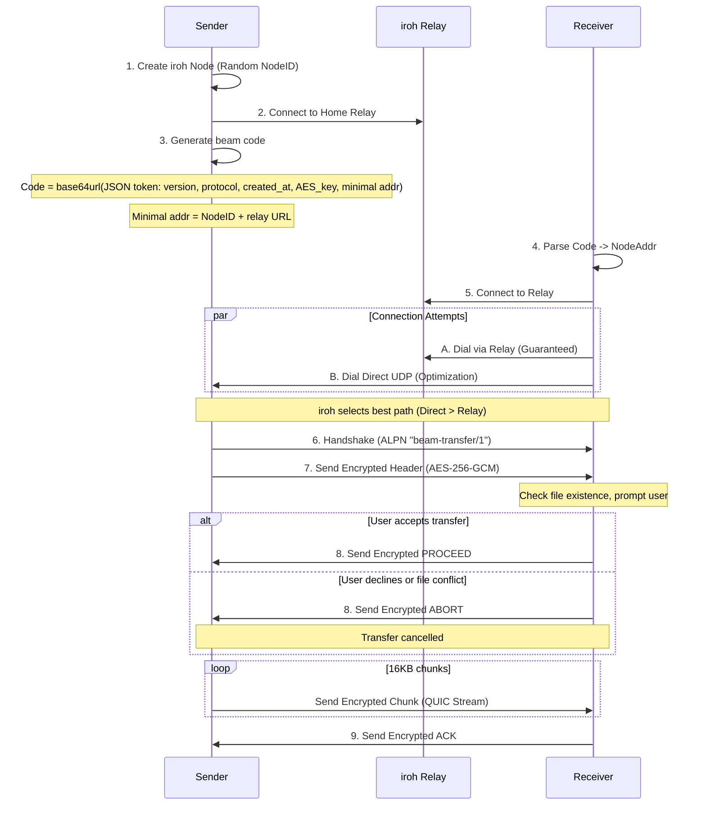
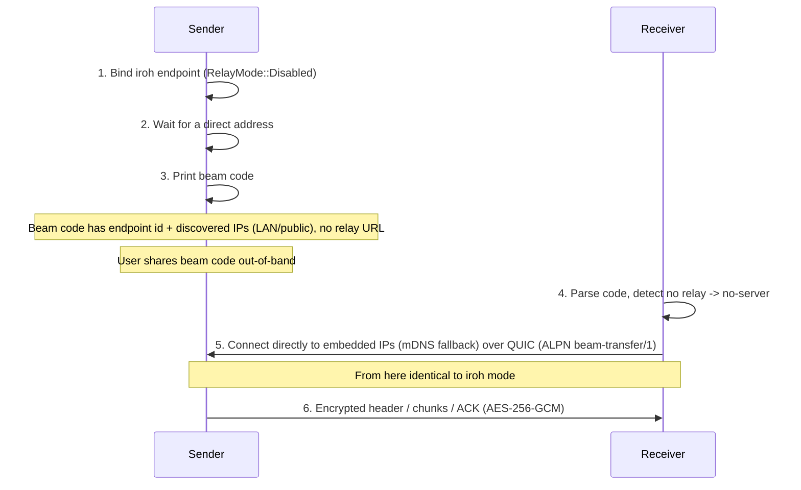
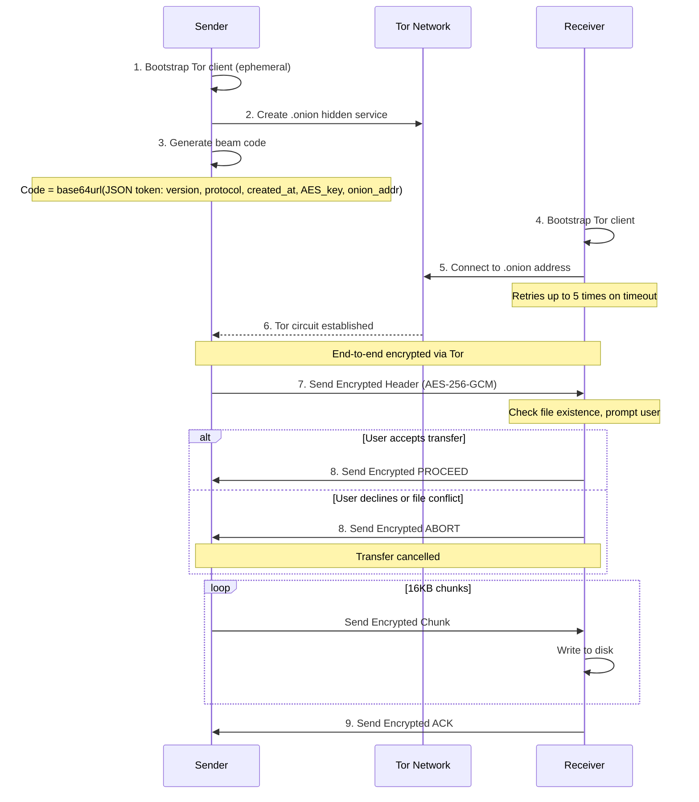

# Beam-rs Architecture

## Overview

This document provides a detailed walkthrough of the beam-rs implementation.

beam-rs supports two main categories of transport:

1. **Internet Transfers** (beam code based):
    - **iroh Mode** (Recommended) - Direct P2P transfers using iroh's QUIC/TLS stack (automatic relay fallback) via `beam-rs send`
    - **Tor Mode**: Anonymous transfers via Tor hidden services (uses `arti`) via `beam-rs-tor send`
2. **Serverless Transfers** (using `beam-rs send --no-server`):
    - **No-server Mode**: transfers using the iroh QUIC/TLS stack with relays disabled (no third-party server). The sender embeds all of its discovered IPs (LAN and any public/port-mapped addresses) in the beam code so the receiver connects directly, with mDNS as a fallback. Uses the same beam code format as iroh mode.

## Transfer Flows

### 1. iroh Transfers

#### Default iroh Mode (Recommended) - QUIC / Direct + Relay

iroh uses a "hole punching" strategy that attempts direct connections via UDP/QUIC while simultaneously establishing a fallback path through a Relay (DERP) server.



#### No-server Mode (iroh with relays disabled)

No-server mode is for transfers without any third-party server (no relay, no
Nostr), and is primarily intended for the same LAN. It is the **same** iroh
transport and beam code as the default mode, with one difference: relays are
disabled (`RelayMode::Disabled`). The sender waits for at least one direct
address, then prints a beam code containing the endpoint ID plus every direct
address iroh discovered (LAN interfaces and any public/port-mapped addresses)
and no relay URL. The receiver auto-detects this mode from the missing relay URL
and connects directly to the embedded addresses, falling back to mDNS. It is not
strictly local-only — enforcing that would be an unnecessary burden — so a WAN
connection may succeed when a public/port-mapped address is reachable, though
NAT and firewalls commonly prevent it. No-server endpoints use a DNS resolver
that does not read host DNS configuration, avoiding macOS scoped-resolver parse
warnings in relay-free mode.



### 2. Tor Transfers

#### Tor Mode



## Connection Types/Modes

### Default iroh Mode (`beam-rs send`) - Recommended
- **Transport**: QUIC / TLS 1.3
- **Discovery**: Relay URL embedded in beam code + mDNS for local network.
- **Relay**: iroh relays (DERP) - automatically used if direct P2P connection fails.
- **Failover**: Uses multiple relays for redundancy; monitors latency to select the best path.
- **Connection**: "Hole punching" attempts to establish a direct UDP connection; falls back to relay if NATs are strict.
- **Protocol**: ALPN `beam-transfer/1`.
- **PIN Support**: Yes (`beam-rs send --pin` / `beam-rs receive --pin`)
- **Encryption**: Always AES-256-GCM encrypted at the application layer, plus QUIC/TLS encryption.

### No-server Mode (`beam-rs send --no-server`)
- **Transport**: QUIC / TLS 1.3 (same as iroh mode)
- **Discovery**: Direct addresses embedded in the beam code (every IP iroh discovered — LAN and any public/port-mapped addresses), with mDNS address lookup as a fallback; relays disabled (`RelayMode::Disabled`)
- **Key Exchange**: Beam code (carries the AES key and an endpoint address with embedded IPs and no relay URL)
- **PIN Support**: No; PIN exchange uses Nostr, a third-party server
- **Encryption**: Always AES-256-GCM at the application layer, plus QUIC/TLS encryption
- **Reachability**: Primarily intended for the same LAN. The sender waits for at least one direct address before printing the code so the embedded addresses are populated (it cannot wait for a relay, since relays are disabled). Not strictly local-only — a WAN connection may succeed when a public/port-mapped address is reachable, but NAT/firewalls commonly prevent it. Incompatible with `--pin` and `--relay-url`.

### Tor Mode (`beam-rs-tor send`)
- **Transport**: Tor Onion Services
- **Discovery**: Onion Address
- **PIN Support**: No
- **Encryption**: Tor circuit encryption plus mandatory AES-256-GCM at the application layer.

## Security Model

### iroh Mode Encryption (Dual Layer)
iroh mode uses two encryption layers for defense in depth:

**Transport Layer (iroh/QUIC)**:
- TLS 1.3/QUIC encryption (cipher negotiated by iroh/quinn)
- Mutual authentication via iroh node identities (NodeID in beam code)

**Application Layer (beam-rs)**:
- AES-256-GCM encryption for all data: headers, chunks, and control signals
- 256-bit key generated per transfer, embedded in beam code

### PIN-based Key Exchange (PIN Mode)
PIN mode is available for the default iroh transport (`beam-rs send --pin`). It
is not available for iroh `--no-server` or Tor.

PIN mode exchanges the beam code through Nostr keyed by a short PIN, then runs
a SPAKE2 handshake over the established QUIC stream to derive the session key.
PIN mode requires internet access for Nostr lookup.

- **Format**: 12 characters (11 random + 1 checksum) from an unambiguous charset; the checksum catches typos before attempting a connection.
- **Key Derivation**: The PIN is fed into SPAKE2 (with transfer_id as context) to derive the session key.
- **Security**: SPAKE2 prevents offline dictionary attacks and rejects wrong transfer_id.
- **Confidentiality**: All data (headers, chunks, and control signals) is AES-256-GCM encrypted with the SPAKE2-derived key, on top of the transport encryption.

### Tor Mode Security
- **Anonymity**: Sender/Receiver IPs hidden.
- **Encryption**: End-to-end via Tor circuit encryption plus mandatory AES-256-GCM at application layer for all data (headers, chunks, and control signals).

### TTL (Time-To-Live) Validation

All beam codes include a creation timestamp and are validated against a TTL to prevent replay attacks and stale session establishment.

**Implementation:**
- **Token Version**: v4 tokens include a `created_at` Unix timestamp
- **TTL Duration**: 60 minutes (`SESSION_TTL_SECS = 3600`)
- **Clock Skew**: Allows up to 60 seconds into the future to handle minor clock drift

**Validation Points:**
1. **Beam Codes** (iroh, iroh `--no-server`, tor): Validated in `parse_code()` before connection. No-server codes use the same v4 token format and are validated the same way.

**Error Messages:**
- Expired codes: "Token expired: code is X minutes old (max 60 minutes). Please request a new code from the sender."
- Future timestamps: "Invalid token: created_at is in the future. Check system clock."

## Wire Protocol Format

### Encrypted Message Format (Stream-based transports)

All encrypted messages (used by Iroh, iroh `--no-server`, and Tor modes) follow this format:

```
[length: 4 bytes BE][encrypted_payload]
```

- **length**: Big-endian u32 indicating total size of `encrypted_payload`
- **encrypted_payload**: `nonce (12 bytes) || ciphertext || tag (16 bytes)`

### Control Signals

Control signals are encrypted messages sent over the same length-prefixed framing as data:

- **PROCEED**: receiver accepts transfer
- **ABORT**: receiver declines transfer
- **ACK**: receiver confirms all expected bytes were received
- **RESUME:<offset>**: receiver requests resume from a byte offset (files only)

These signals are not tied to chunk numbers and use fresh random nonces like all other encrypted messages.

### Resumable File On-Disk Flow

Resumable state is only used for **file** transfers (not folders) when resume is enabled.

- Receiver writes incoming bytes to a resume temp file in the target directory:
  `<final_path>.beam-rs.partial`
- That temp file contains a fixed-size metadata header (checksum, expected size,
  bytes received, filename) followed by file data.

When the transfer completes successfully:

1. Receiver writes payload bytes (without metadata header) to a staging file:
   `<final_path>.partial` in the same directory.
2. Receiver syncs the staging file and parent directory.
3. Receiver atomically renames staging to the final destination path.
4. Receiver removes `<final_path>.beam-rs.partial`.

Keeping both temp/staging files in the same directory ensures the final rename
is on the same filesystem, which enables atomic replacement semantics.

### Nonce Derivation

AES-256-GCM requires a unique 12-byte nonce for each encryption operation with
the same key. beam-rs generates a fresh random 96-bit nonce per message and
prefixes it to the ciphertext, so the receiver can decrypt directly. With 16KB
chunks and a per-transfer key, the conservative 2^32 random-nonce limit
corresponds to ~64 TiB per transfer.

### Confirmation Handshake

Before data transfer begins, the receiver validates the incoming transfer:

1. **Sender** sends encrypted file header containing filename, size, and transfer type
2. **Receiver** checks:
   - If file already exists at destination
   - If user wants to proceed (interactive prompt)
3. **Receiver** responds with:
   - **PROCEED**: Accept transfer, sender begins sending data chunks
   - **ABORT**: Decline transfer, connection is closed

This handshake prevents:
- Accidental file overwrites without user consent
- Wasted bandwidth on declined transfers
- Sender continuing after receiver has disconnected
